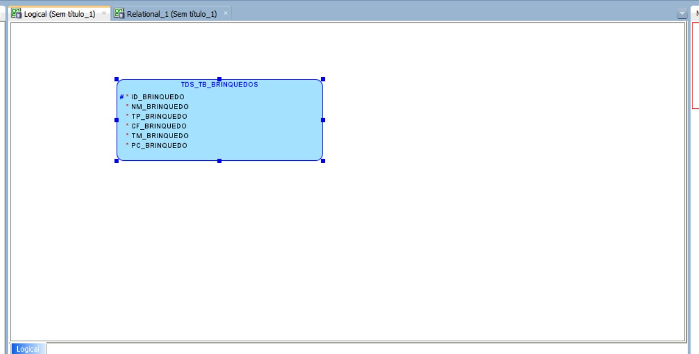
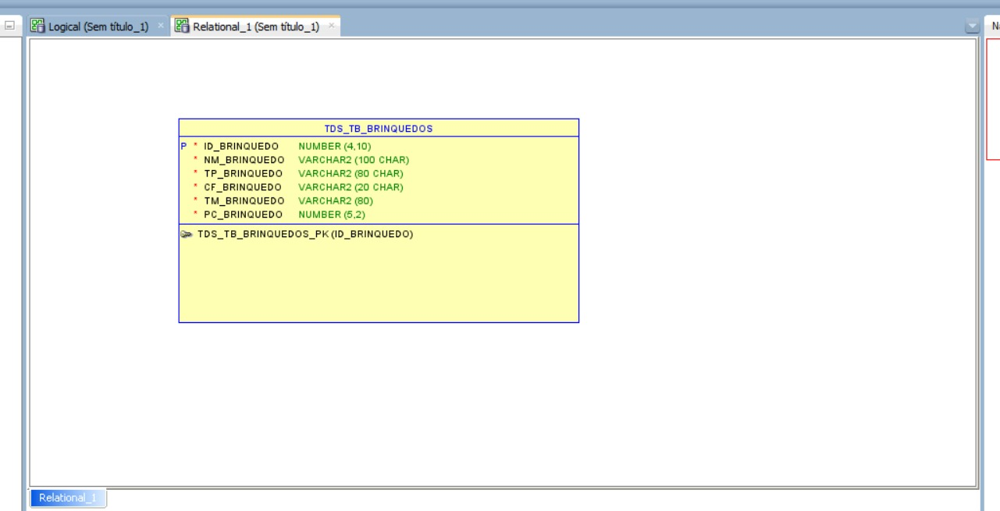
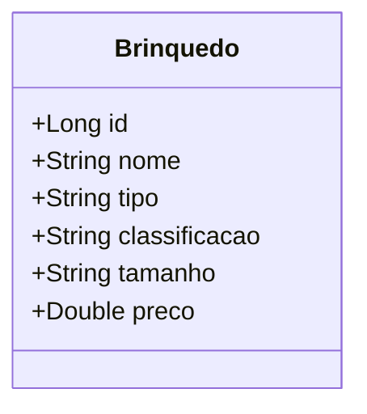

# CP2 - API de Brinquedos

Projeto desenvolvido para o CheckPoint 2 da disciplina de Programação Spring Boot com Persistência (Professor: Dr. Marcel Stefan Wagner).

## Integrantes
-Vitória Rodrigues Martins 
565160

-Augusto Bonomo Júnior 
565155

-Thomas Fontes 
562254

-Gabriel Maciel
RM562795

-Matheus Pereira Molina
RM563399

## Sobre o Projeto
Este é um aplicativo para uma empresa de brinquedos (crianças até 14 anos) desenvolvido em Spring Boot usando a linguagem Java e gerenciador de dependências Maven.
O projeto implementa uma API RESTFUL completa (CRUD - Create, Read, Update e Delete) conectada ao banco de dados Oracle usando JPA/Hibernate.

### Tecnologias e Dependências
- **Linguagem**: Java 21
- **Framework**: Spring Boot 3.x
- **Dependências**:
  - Spring Web
  - Spring Data JPA
  - Validation
  - Oracle Driver

Abaixo, as imagens de modelagem do banco de dados (Lógico e Relacional).

---

## Como Rodar e Testar

1. Certifique-se de que o **Oracle SQL Developer** esteja rodando localmente (porta 1521).
2. O usuário e senha configurados no `application.properties` são `RM562795` e `060205`. Altere a senha se necessário.
3. Inicie o projeto pelo IDE ou rodando `mvn spring-boot:run`. O Tomcat rodará na porta **8080**.
4. Teste a API pelo **Postman** ou **Insomnia**.

---

## Exemplos de JSON para o CRUD (Postman / Insomnia)

Abaixo estão as estruturas JSON para você colar no Body (raw -> JSON) nas requisições.

### 1. CREATE (POST)
**Endpoint**: `http://localhost:8080/brinquedos`

**JSON de Requisição:**
```json
{
  "nome": "Boneco Max Steel",
  "tipo": "Ação",
  "classificacao": "Livre",
  "tamanho": "Médio",
  "preco": 89.90
}
```

### 2. READ (GET) - Listar Todos
**Endpoint**: `http://localhost:8080/brinquedos`
*(Não precisa de JSON no Body)*

### 3. READ (GET) - Buscar por ID
**Endpoint**: `http://localhost:8080/brinquedos/1`
*(Não precisa de JSON no Body)*

### 4. UPDATE (PUT)
**Endpoint**: `http://localhost:8080/brinquedos/1`

**JSON de Requisição (atualizando o preço):**
```json
{
  "nome": "Boneco Max Steel - Edição Especial",
  "tipo": "Ação",
  "classificacao": "10 anos",
  "tamanho": "Grande",
  "preco": 120.50
}
```

### 5. DELETE (DELETE)
**Endpoint**: `http://localhost:8080/brinquedos/1`
*(Não precisa de JSON no Body)*

---

## Documentação Técnica Extra

### Modelagem de Dados (Oracle)

#### Modelo Lógico


#### Modelo Relacional


### Diagrama de Classes (UML)
Abaixo, a representação da classe principal do projeto:



### Script DML (Exemplos de Inserção)
Caso deseje popular o banco de dados Oracle manualmente via SQL Developer:

```sql
INSERT INTO TDS_TB_Brinquedos (nome, tipo, classificacao, tamanho, preco) 
VALUES ('Carrinho de Controle Remoto', 'Veículos', '8+', 'Médio', 189.90);

INSERT INTO TDS_TB_Brinquedos (nome, tipo, classificacao, tamanho, preco) 
VALUES ('Boneca Articulada', 'Bonecas', 'Livre', 'Grande', 120.00);

INSERT INTO TDS_TB_Brinquedos (nome, tipo, classificacao, tamanho, preco) 
VALUES ('Lego Star Wars', 'Blocos de Montar', '10+', 'Pequeno', 250.50);

COMMIT;
```


